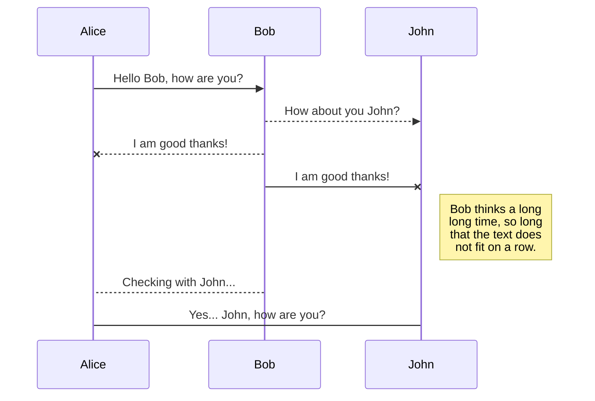
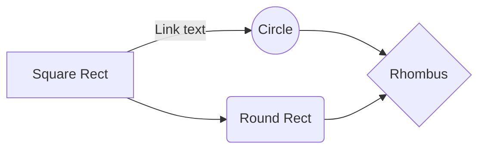

# Welcome to Smart Places Protocol!

A decentralized protocol for the instant creation of crypto-based social communities.
https://smartplacesprotocol.io

# Important Addresses

We are currently deployed on BSC, with a strategy plan for moving to Ethereum in the future ( 🔜 ).

> ⚠️ **Remember, only trust the addresses below** when interacting with
> Smart Places Protocol or the SMARTEE token.

### Deployment addresses ↘️
|Blockchain     |Contract address                          |Deployer                         |
|----------------|-------------------------------|-----------------------------|
|BSC Mainnet | `*To be announced*` |`0xC2EbaE7C61cd3E78D8BAf27a2ccab2cE7C7cE422`           |
|BSC Testnet          |`0x877258BbD1545BA049A010439b4843956C323dAE`            |`0xC2EbaE7C61cd3E78D8BAf27a2ccab2cE7C7cE422`            |

### SmartPlaces Official addresses ↘️
|Blockchain     |Description                          |Address                         |
|----------------|-------------------------------|-----------------------------|
|BSC Mainnet | SPP Marketing Address |`*To be announced* `           |
|BSC Testnet | SPP Charity Address |`*To be announced*`           
|BSC Mainnet | SPP Burn Address |`0x000000000000000000000000000000000000dEaD`           |

# Method Reference
Here at SmartPlaces, we're commited to the *transparency* and *comprehensibility* of our tech - two very important values of Open Source software development.   
Below, we maintain a  list of all functions and methods used in the Smart Places Protocol Smart Contract, during its operation -- along with their description.

    ***To be written***

## Operation Flowcharts

Lorem ipsum dolor sit amet, consectetur adipiscing elit. Duis tempor varius vulputate. Curabitur efficitur at libero vel ultrices. Pellentesque eget ipsum ultricies, ullamcorper dolor eu, tincidunt risus.

And this will produce a flow chart:

